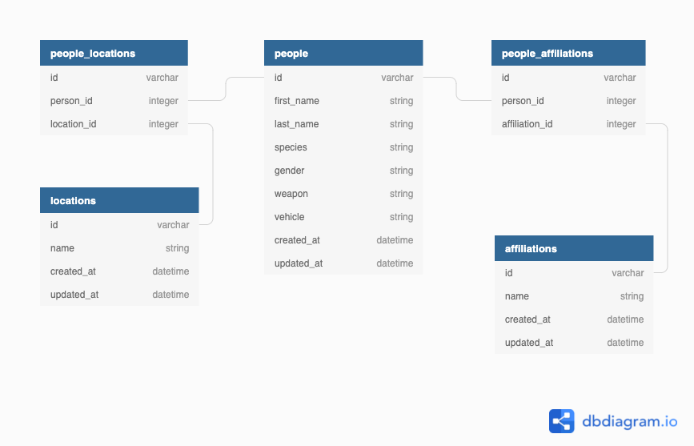

# An Excel Spreadsheet importer demo with React on Rails

## Features

An minimal importer app that allows users to upload .xls/.xlsx (.csv to be implemented) files and view the results in a table:

- Frontend: React + React Router + React Query + Axios
- Backend: Ruby on Rails + PostgreSql
- UI lib: Material UI + Material Table

## Database Schema



## Quick Start

```sh
$ git clone https://github.com/jacinyan/spreadsheet-importer-demo.git
$ cd spreadsheet-importer-demo/

# Install dependencies
$ bundle install && yarn install

# Database migration
$ rails db:create
$ rails db:migrate

# Run!
$ rails s [-p] [<PORT>]

Then open http://localhost:<PORT>
```

## TODD

- Implement CSV frontend logic
- Error handling
- Continuation on Test Cases
- Responsive layout
